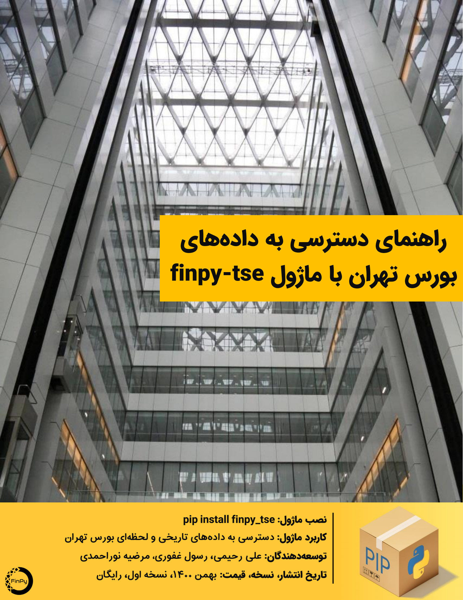

# finpy-tse
A Python Module to Access Tehran Stock Exchange Historical and Real-Time Data 

# The Farsi handbook is not updated for new features of 1.1.0 release, but highlighted with orange font, in the example notebook. 

Module Support Group: https://t.me/FinPyGroup 

More Farsi Examples on How to Use the Module: https://t.me/FinPy 
